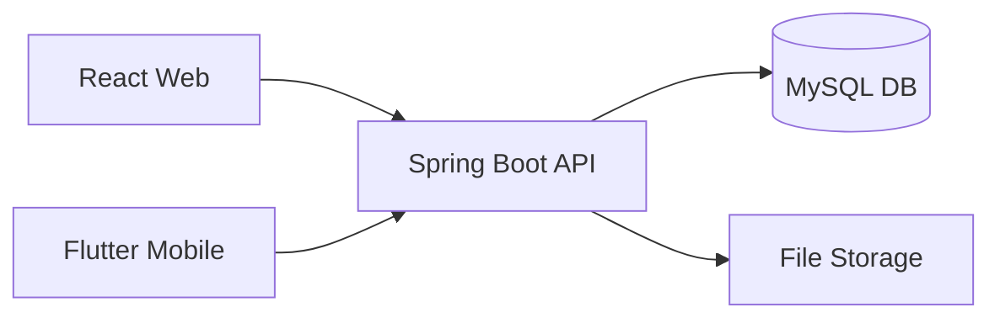

# NexusTasks

> Enterprise-grade Task Management Platform (Web & Mobile)

## 📋 Table of Contents
- [Overview](#overview)
- [Architecture](#architecture)
- [Tech Stack](#tech-stack)
- [Getting Started](#getting-started)
- [API Documentation](#api-documentation)
- [Deployment](#deployment)
- [Contributing](#contributing)
- [License](#license)

---

## 🌟 Overview
NexusTasks is a robust, secure, and scalable task management application designed as a software engineering laboratory. It demonstrates best practices in backend architecture, modern frontend UX, mobile development, and DevSecOps.

---

## 🏗️ Architecture

---

## 🛠️ Tech Stack
- Backend: Java 21, Spring Boot 3, Spring Security, MySQL, Flyway
- Frontend: React, TypeScript, Vite, Tailwind CSS, TanStack Query
- Mobile: Flutter, Riverpod, Dio
- DevOps: Docker, GitHub Actions, GCP (Cloud Run)

---

## 🚀 Getting Started
(Instructions will be added in Phase 25 - Docker)

---

## 📖 API Documentation
(Swagger/OpenAPI link will be added in Phase 13)

---

## 📜 License
This project is licensed under the MIT License - see the LICENSE file for details.