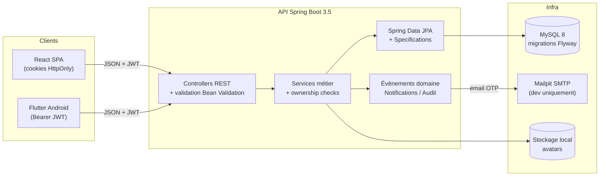
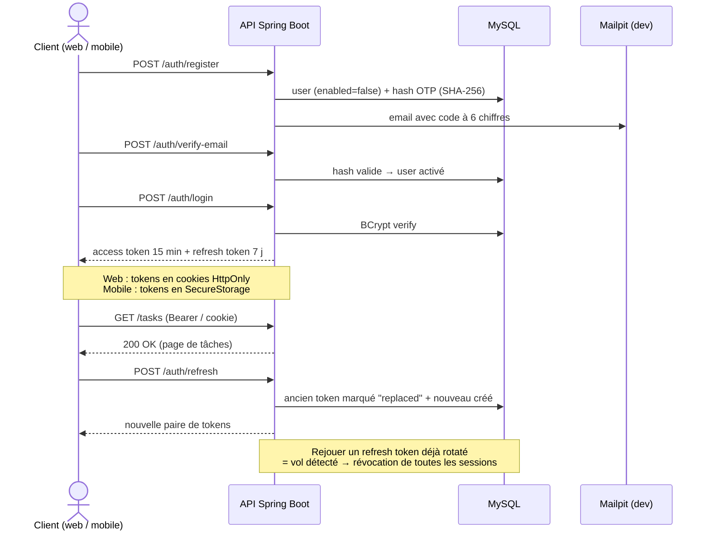
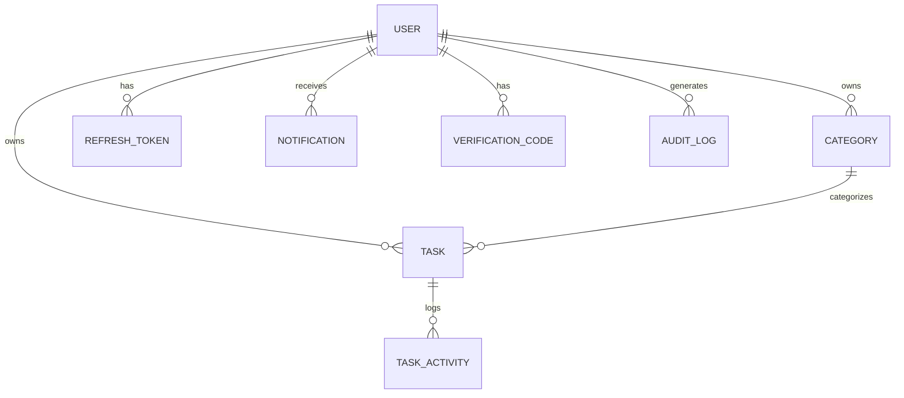

# NexusTasks

[](https://github.com/Delfred237/nexus-tasks/actions/workflows/backend-ci.yml)
[](https://github.com/Delfred237/nexus-tasks/actions/workflows/frontend-ci.yml)
[](https://github.com/Delfred237/nexus-tasks/actions/workflows/mobile-ci.yml)

**NexusTasks** est une plateforme de gestion de tâches full-stack : une API Spring Boot
consommée par **deux clients** — une SPA React et une application Flutter Android —
partageant le même contrat d'API, la même sécurité et le même design system.

## ✨ Fonctionnalités

- 🔐 **Authentification complète** : inscription, vérification email par OTP, login,
  refresh token **avec rotation et détection de vol**, logout multi-sessions
- ✅ **Tâches** : CRUD, statuts, priorités, échéances, archivage réversible, historique d'activité
- 🏷️ **Catégories** : CRUD avec couleurs et slugs uniques par utilisateur
- 🔎 **Recherche avancée** : full-text, filtres multi-critères, pagination et tri serveur
- 🔔 **Notifications in-app** event-driven avec compteur de non-lues
- 👤 **Profil** : édition, changement de mot de passe, upload d'avatar validé côté serveur
- 🛡️ **Sécurité** : ownership checks systématiques, BCrypt, validation stricte, cookies HttpOnly
- 📱 **Parité web/mobile** : mêmes endpoints, mêmes règles métier, même identité visuelle

## 🧱 Stack technique

| Couche | Technologies |
|---|---|
| **Backend** | Java 21, Spring Boot 3.5, Spring Security + JWT, Spring Data JPA, MySQL 8, Flyway, SpringDoc OpenAPI, Testcontainers |
| **Web** | React 18, TypeScript, Vite, Tailwind CSS v4, shadcn/ui, TanStack Query, Zustand, React Router, React Hook Form + Zod, Recharts, Vitest |
| **Mobile** | Flutter 3.47 (Android), Material 3, Riverpod 3, GoRouter, Dio, flutter_secure_storage, reactive_forms, mocktail |
| **Infra** | Docker Compose (MySQL, Mailpit, backend, frontend nginx), GitHub Actions CI |

## 🏗️ Architecture



### Flux d'authentification



### Modèle de données (extrait)



## 🚀 Démarrage rapide

Prérequis : Docker + Docker Compose.

```bash
git clone https://github.com/Delfred237/nexus-tasks.git
cd nexus-tasks/docker
docker compose up --build -d
```

| Service | URL |
|---|---|
| Frontend (nginx) | http://localhost:5173 |
| API + Swagger UI | http://localhost:8080/swagger-ui.html |
| Mailpit (emails dev) | http://localhost:8025 |
| MySQL | localhost:3307 |

Développement sans Docker (HMR) : voir les README
[backend](backend/README.md), [frontend](frontend/README.md), [mobile](mobile/README.md).

## 📁 Structure du monorepo

```
nexus-tasks/
├── backend/    # API Spring Boot (feature-based)
├── frontend/   # SPA React (feature-based)
├── mobile/     # App Flutter Android (feature-first)
├── docker/     # docker-compose (mysql, mailpit, backend, frontend)
├── docs/adr/   # Architecture Decision Records
└── .github/    # Workflows CI (3 couches)
```

## 🧪 Tests

| Couche | Commande | Contenu |
|---|---|---|
| Backend | `cd backend && ./mvnw test` | Unitaires + intégration Testcontainers (MySQL réel) |
| Frontend | `cd frontend && npm test` | Unitaires + widget tests Vitest / Testing Library |
| Mobile | `cd mobile && flutter test` | Unitaires (mocktail) + widget tests |

La CI exécute ces trois suites sur chaque push (voir badges ci-dessus).

## 📚 Décisions d'architecture

- [ADR-001 — Choix du tech stack](docs/adr/001-tech-stack.md)
- [ADR-002 — Stratégie d'authentification](docs/adr/002-auth-strategy.md)

## 🗺️ Statut du projet

- [x] Backend complet (auth, tâches, catégories, notifications, audit, avatar)
- [x] Frontend React complet (landing, dashboard, CRUD, recherche, profil)
- [x] Mobile Flutter à parité (auth, CRUD, notifications, profil, APK release)
- [x] CI GitHub Actions (3 workflows) + branch protection
- [ ] Déploiement GCP (free tier) — à venir

## 📄 Licence

MIT